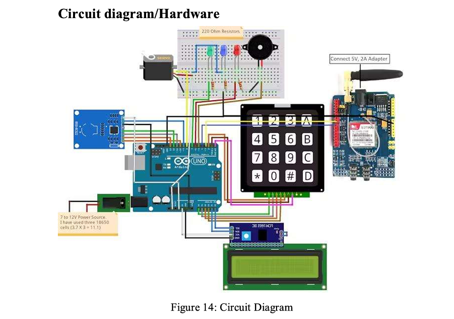
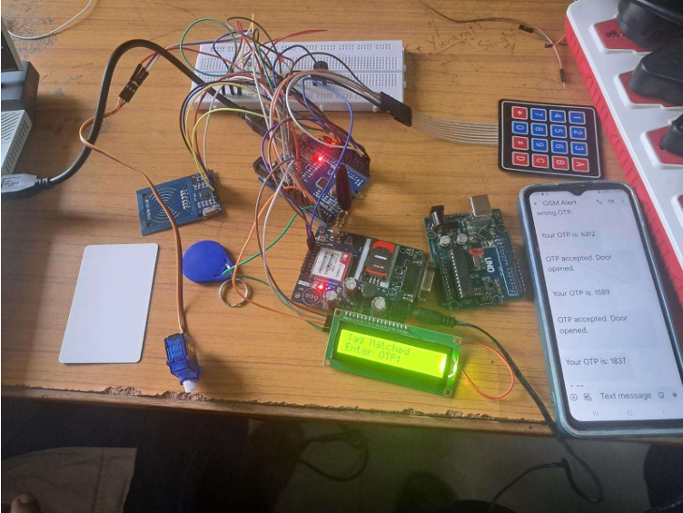

# Dual-Factor RFID & GSM Door Lock Security System

> A hardware-based access control system integrating Radio Frequency Identification (RFID), One-Time Password (OTP) verification, and real-time GSM SMS alerts using Arduino.

## 📄 Full Project Documentation
For an in-depth analysis of the system architecture, security vulnerabilities addressed, and hardware integration methodology, please review the [Full Project Report](RFID_Door_Lock_Final_Report.pdf).

## Objective
Traditional static locks and standalone RFID systems are vulnerable to credential theft. This project engineers a two-step verification security pipeline: initial contactless RFID authentication followed by a dynamic OTP sent directly to the user's mobile device. Access is only granted when both hardware logic and remote GSM verification succeed.

## Tech Stack & Hardware
* **Microcontroller:** Arduino Uno (ATmega328P)
* **Communication:** SIM900 GSM Module (AT Commands, UART)
* **Authentication:** MFRC522 RFID Reader (SPI), 4x4 Matrix Keypad
* **Actuation & Display:** SG90 Micro-servo motor, 16x2 I2C LCD Display
* **Programming:** C++ (Arduino IDE)

## Key System Features
* **Two-Step Verification:** Requires both a registered passive RFID tag UID and a dynamically generated 4-digit OTP.
* **Real-Time GSM Alerts:** Transmits immediate SMS notifications for access granted, access denied (wrong tag), and failed OTP attempts.
* **Remote Override:** Capable of processing incoming SMS commands (e.g., "open", "close") to manually actuate the servo motor and override the physical lock.
* **Hardware Feedback:** Integrated LED and piezoelectric buzzer logic to provide instantaneous physical security feedback.

## System Architecture & Visuals

## How It Works (State Machine Logic)
1. **Standby State:** LCD prompts for RFID scan. System awaits SPI data from the MFRC522.
2. **Auth Phase 1 (RFID):** Scanned UID is compared against authorized registry. If false, trigger buzzer/red LED and send "Access Denied" SMS. If true, generate OTP.
3. **Auth Phase 2 (GSM/OTP):** SIM900 module transmits the OTP to the registered mobile number. System awaits 4x4 keypad matrix input.
4. **Actuation State:** If keypad input matches the generated OTP, the SG90 servo rotates 90° to disengage the lock for 5 seconds, triggering a green LED and a success SMS.

## Repository Structure & Code
* [`rfid_door_lock_GSM_CODE.ino`](rfid_door_lock_GSM_CODE.ino): The main C++ source code containing the SPI, I2C, and UART communication logic for the two-step verification system.
